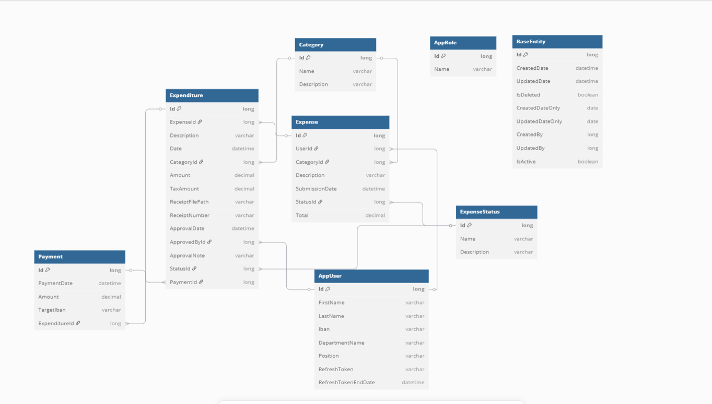

# ExpenseManagementSystem

## 📅 Proje Özeti

*Expense Management System*, çalışanların masraf girişlerini yapabildiği, yöneticilerin ise bu masrafları onaylayabildiği, ödeme süreçlerinin takip edildiği bir masraf yönetim sistemidir. Rol bazlı erişim yapısı sayesinde; yöneticiler tüm masrafları inceleyip onaylayabilirken, personel yalnızca kendi masraflarını görebilir ve giriş yapabilir.

---

## 🎓 Kullanılan Teknolojiler
- ASP.NET Core Web API
- Entity Framework Core - Code First
- *PostgreSQL* – İlişkisel veritabanı yönetim sistemi
- *Dapper* –  Performanslı sorgulamalar için
- *FluentValidation* – Girdi doğrulama işlemleri
- *MediatR* – CQRS desenine uygun komut/sorgu ayrımı
- *JWT Authentication* – Güvenli kimlik doğrulama ve rol bazlı yetkilendirme
- *Swagger* – API dokümantasyonu ve test arayüzü
- *AutoMapper* – Entity-DTO dönüşümleri
- - **Unit of Work & Repository Pattern** – Katmanlı mimari için veri erişim yönetimi

---

## 📊 Veritabanı Diyagramı




---

## 🚀 Projenin Çalıştırılması

Projeyi çalıştırmak için aşağıdaki adımları izleyin:

1. Bu repoyu klonlayın.
2. appsettings.Development.json dosyası içerisindeki *PostgreSQL  bağlantı dizesini* kendi local bağlantınızla değiştirin.
3. ExpenseManagementSystem.WebAPI projesine sağ tıklayarak *Set as Startup Project* seçeneğini seçin.
4. *Package Manager Console’u açın ve **Default Project* alanını ExpenseManagementSystem.Persistence olarak ayarlayın.
5. Aşağıdaki komutu çalıştırarak veritabanını oluşturun:

   ```bash
   update-database
6. Projeyi çalıştırın ve Swagger arayüzü üzerinden API uç noktalarını test edin.

   
   ## 👥 Rollere Göre Yetkilendirme

| Rol      | Yetkiler                                                            |
|----------|---------------------------------------------------------------------|
| **Admin**    | Tüm kullanıcıların işlemlerini görme, masraf onayı, ödeme, ödeme takibi |
| **Personel** | Kendi masraflarını görüntüleme ve yeni masraf girişi yapma       |
   
